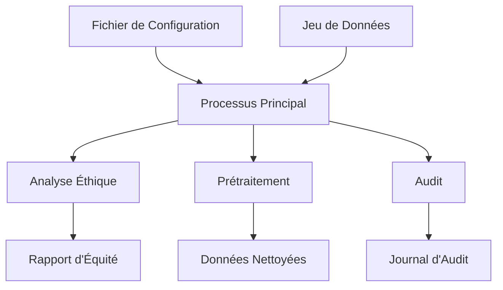
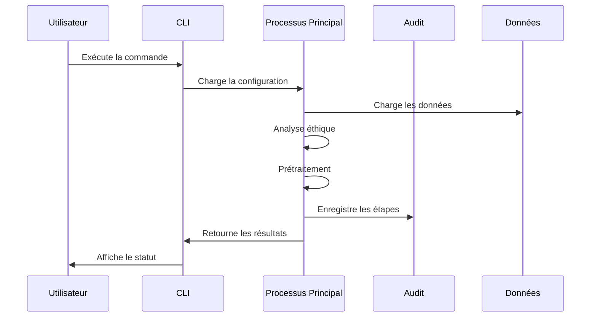

# Configuration et Utilisation de FairAutoCleaner

## Introduction
FairAutoCleaner est un outil innovant de prétraitement automatisé des données, conçu pour garantir à la fois l'efficacité technique et l'équité éthique dans le traitement des données. Ce chapitre présente en détail les aspects de configuration et d'utilisation de l'outil.

## Architecture Globale


## Configuration de l'Outils

### Structure du Fichier de Configuration
Le fichier JSON de configuration se structure en trois parties principales :

1. **Métadonnées du Dataset**
```json
"dataset": {
    "title": "Jeu de données bancaires",
    "description": "Données clients pour prédiction d'attrition",
    "target": "churn",
    "sensitive_features": ["genre", "age"]
}
```

2. **Paramètres de Prétraitement**
```json
"preprocessing": {
    "normalization": {
        "enabled": true,
        "method": "standard",
        "exclude_features": ["id_client"]
    },
    "dim_reduction": {
        "enabled": true,
        "method": "pca",
        "target_explained_variance": 0.95
    }
}
```

3. **Analyse de Code**  
Cette section optionnelle permet d'analyser les scripts de prétraitement pour détecter d'éventuels biais algorithmiques. Elle offre :
- La possibilité de spécifier les répertoires à analyser
- Le choix entre analyse syntaxique ou IA
- Un niveau de sensibilité configurable (1-10)
- Une traçabilité complète des analyses effectuées
- Des recommandations concrètes pour corriger les biais détectés
- La génération automatique de rapports détaillés
```json
"code_analysis": {
    "paths": ["scripts/preprocessing"],  // Répertoires à analyser
    "type": "ai",  // Type d'analyse (syntax/ai)
    "sensitivity_level": 7,  // Niveau de détection des biais (1-10)
    "report_level": "detailed",  // Niveau de détail du rapport (basic/detailed)
    "exclude_patterns": ["test_*.py"],  // Fichiers à exclure de l'analyse
    "max_file_size": 1048576  // Taille maximale des fichiers à analyser (1MB par défaut)
}
```

### Validation de la Configuration
La classe `Config` assure la validation des paramètres :
```python
@dataclass
class Config:
    dataset_config: Dict[str, Any]
    output_dir: Path
    sample_size: int = 1000
    profile_threshold: int = 10000
```

## Processus d'Utilisation

### Workflow Principal


Le workflow principal de FairAutoCleaner suit une séquence d'interactions bien définie entre l'utilisateur et les différents composants du système. L'utilisateur initie le processus via l'interface en ligne de commande (CLI) qui orchestre l'exécution des différentes étapes. Le processus principal charge d'abord la configuration et les données, puis effectue l'analyse éthique et le prétraitement tout en enregistrant chaque étape dans le système d'audit. Enfin, les résultats sont retournés à l'utilisateur via l'interface CLI.

1. Initialisation de l'audit
2. Chargement des données
3. Analyse éthique automatique
4. Prétraitement des données
5. Génération des rapports

### Interface en Ligne de Commande
```bash
python -m FairAutoCleaner \
    --config configuration.json \
    --dataset donnees.csv \
    --output resultats/
```

### API Python
```python
from FairAutoCleaner import process_dataset

resultats = process_dataset(
    config_path="config.json",
    dataset_path="data.csv", 
    output_path="output/"
)
```

## Résultats et Rapports

### Structure des Sorties
```
resultats/
├── cleaned_data.csv
├── audit_trail.json
├── fairness_report.md
├── logs/
│   └── processing.log
└── profiles/
    ├── initial_profile.html
    └── final_profile.html
```

### Journal d'Audit
Le fichier JSON d'audit contient :
- Timestamps des opérations
- Paramètres utilisés
- Métriques de performance
- Avertissements et erreurs
- Détails des transformations

## Conclusion
FairAutoCleaner offre une solution complète pour le prétraitement éthique des données, combinant automatisation technique et vigilance éthique. Sa configuration modulaire et ses rapports détaillés en font un outil essentiel pour les projets de science des données responsables.
